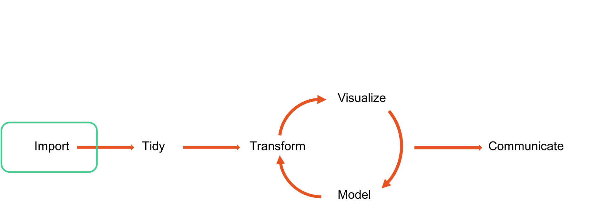
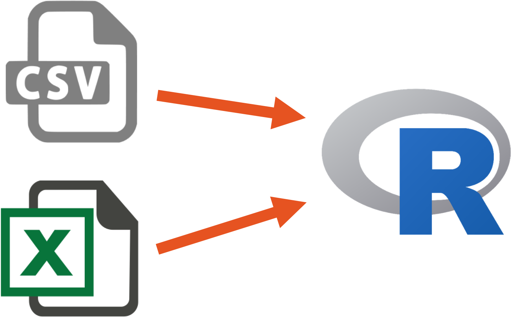
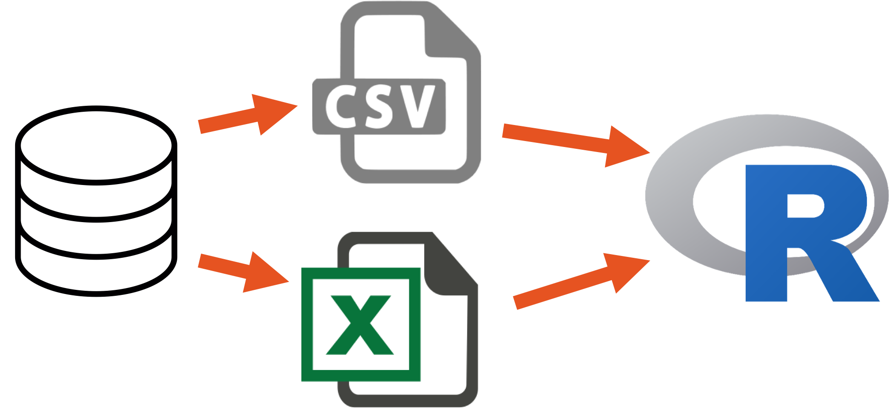
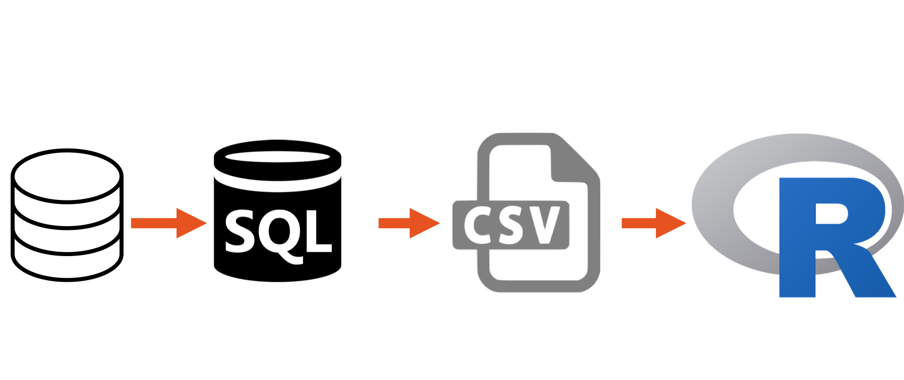
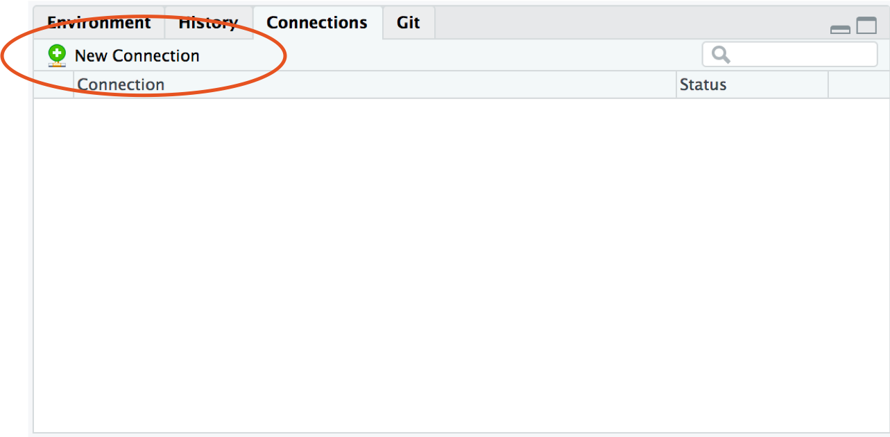
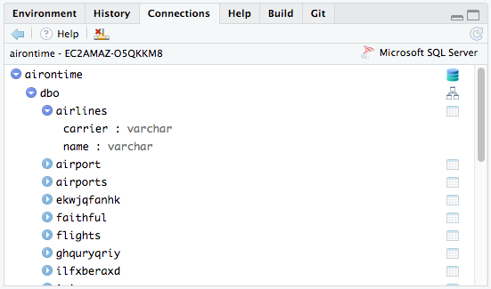
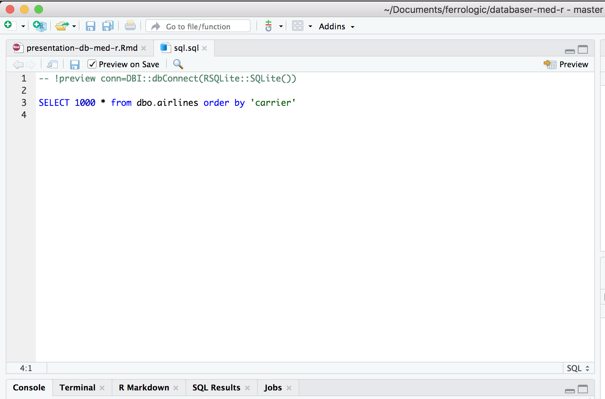
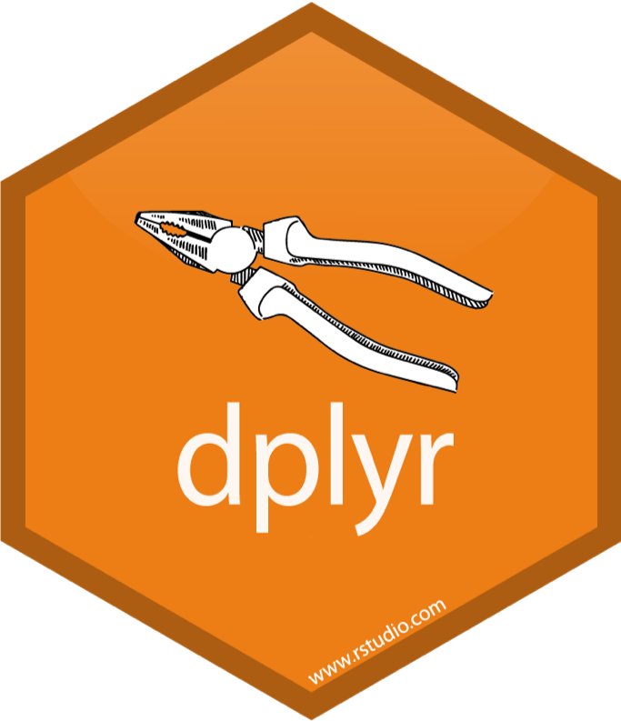

```{r setup, include=FALSE}
knitr::opts_chunk$set(echo = TRUE)
```

##  {.centered}
```{r out.width = "70%", echo=FALSE}
 
```

## Hur använder vi data i R? {.centered}
```{r out.width = "100%", echo=FALSE}
 
```

## Det vanliga förfarandet {.centered}
```{r out.width = "80%", echo=FALSE}
 
```

## Och med databaser då?{.centered}
```{r out.width = "80%", echo=FALSE}
 
```

## Och med databaser då?{.centered}
```{r out.width = "80%", echo=FALSE}
 
```

## Några miljoner rader senare...
<iframe src="https://giphy.com/embed/3ohs81rDuEz9ioJzAA" width="480" height="358" frameBorder="0" class="giphy-embed" allowFullScreen></iframe><p><a href="https://giphy.com/gifs/angry-mad-computer-3ohs81rDuEz9ioJzAA">via GIPHY</a></p>

## Alternativ? {.centered}
```{r out.width = "100%", echo=FALSE}
 
```

## Finns numera god möjligheter att göra allt du behöver i RStudio 1.2 {.centered}
```{r out.width = "80%", echo=FALSE}
 
```

## Utforska databasen {.centered}
```{r out.width = "60%", echo=FALSE}
 
```

## Du kan till och med skriva SQL {.centered}
```{r out.width = "60%", echo=FALSE}
 
```

## Men varför skriva SQL? {.centered}
```{r out.width = "40%", echo=FALSE}
 
```

## Ett exempel
- Vår egen Snowflake-databas med data från FIS
```{r connection_hidden, echo=FALSE,message=FALSE,warning=FALSE}
library(dplyr.snowflakedb)
library(keyring)
library(dplyr)
options(dplyr.jdbc.classpath = "/Users/filipwastberg/Downloads/snowflake-jdbc-3.6.9.jar")
```
```{r connection_open, echo=TRUE, message=FALSE}
my_db <- src_snowflakedb(user = keyring::key_list("snowflake")[1,2],
                         password = keyring::key_get("snowflake"),
                         account = "ferrologic",
                         region = "eu-central-1",
                         opts = list(warehouse = "SWESKI_ANALYTICS",
                                     db = "SWESKI_DB",
                                     schema = "SWESKI_SCHEMA"))
```

## Det vanliga är dock odbc
```{r, eval=FALSE}
library(odbc)
con_userdb <- dbConnect(odbc::odbc(), 'master_db', encoding = "latin1")
```

## Vi är nu uppkopplade mot databasen{.centered}
```{r out.width = "60%", echo=FALSE}
 
```

## SQL
```{sql_ex, eval=FALSE}
SELECT "ORIGIN_STATE_ABR", AVG("DEP_DELAY") AS "DEP_DELAY_AVG"
FROM "airline"
GROUP BY "ORIGIN_STATE_ABR"
```

## dplyr
```{r cars_ex, echo=TRUE}
mtcars %>%
  group_by(cyl) %>%
  summarise(mean_mpg = mean(mpg), sd_mpg = sd(mpg))
```

## SQL är inte gjort för dataanalys
- Men det är dplyr 

## Använd dplyr för att skriva SQL-kod
```{r look_table, col.print = 6, echo=TRUE}
tbl(my_db, "RESULTAL") %>%
  head()
```

## I bakgrunden skriver dplyr SQL åt dig
```{r query1, echo=TRUE}
tbl(my_db, "RESULTAL") %>%
  head() %>%
  show_query()
```

## Vi kan göra mer komplexa queries
```{r complex_query}
tbl(my_db, "CUPRESULT") %>%
  left_join(tbl(my_db, "COMPETITOR") %>%
              select(COMPETITORID, NATIONCODE), by = c("COMPETITORID")) %>%
  filter(SEASONCODE == 2018 & CUPID == "WC" & SECTORCODE == "AL") %>%
  group_by(NATIONCODE) %>%
  summarise(points_per_country = sum(POINTS, na.rm = TRUE) / n()) %>%
  arrange(desc(points_per_country)) %>%
  head(10)
```

## Åter igen, det här är bara SQL-queries
```{r show_complex_query, echo=FALSE}
tbl(my_db, "CUPRESULT") %>%
  left_join(tbl(my_db, "COMPETITOR") %>%
              select(COMPETITORID, NATIONCODE), by = c("COMPETITORID")) %>%
  filter(SEASONCODE == 2018 & CUPID == "WC" & SECTORCODE == "AL") %>%
  group_by(NATIONCODE) %>%
  summarise(points_per_country = sum(POINTS, na.rm = TRUE) / n()) %>%
  arrange(desc(points_per_country)) %>%
  head() %>%
  show_query()
```

## Vi utnyttjar det bästa i SQL
>- Vi kan sedan spara data från en query till en data.frame.

```{r save_query_df}
points_per_country <- tbl(my_db, "CUPRESULT") %>%
  left_join(tbl(my_db, "COMPETITOR") %>%
              select(COMPETITORID, NATIONCODE), by = c("COMPETITORID")) %>%
  filter(SEASONCODE == 2018 & CUPID == "WC" & SECTORCODE == "AL") %>%
  group_by(NATIONCODE) %>%
  summarise(points_per_country = sum(POINTS, na.rm = TRUE) / n()) %>%
  arrange(desc(points_per_country)) %>%
  head(10) %>%
  collect()
```

## Data kan vi sedan använda precis hur vi vill i R

```{r message=FALSE}
library(readxl)
countries <- read_excel("/Users/filipwastberg/Documents/ferrologic/countrycodes.xlsx")

points_per_country <- points_per_country %>%
  mutate(NATIONCODE = case_when(
    NATIONCODE == "GER" ~ "DEU",
    NATIONCODE == "SUI" ~ "CHE",
    TRUE ~ as.character(NATIONCODE)
  ))

points_with_flag <- left_join(points_per_country, countries) %>%
  mutate(A2 = tolower(A2))
```
## Data kan vi sedan använda precis hur vi vill i R

```{r echo=FALSE}
library(ggplot2)
library(ggflags)
ggplot(points_with_flag,
       aes(x = reorder(NATIONCODE, points_per_country),
           y = points_per_country, country = A2)) +
  geom_bar(stat = "identity") +
  coord_flip() +
  guides(country = FALSE) +
  geom_flag() + 
  scale_country() +
  theme_minimal() +
  labs(x = "", y = "Points per country",
       title = "FIS Points per country 2018",
       subtitle = "Source: FIS Database") 
```

## Men du behöver inte ladda ner data
```{r dbcompute_hidden, eval=FALSE}
library(dbplot)
library(scales)
tbl(my_db, "CUPRESULT") %>%
  left_join(tbl(my_db, "COMPETITOR") %>% 
              select(COMPETITORID, NATIONCODE),
            by = c("COMPETITORID")) %>%
  filter(GENDER %in% c("L", "M")) %>%
  db_compute_count(GENDER) %>%
  rename(n = "n()") %>%
  ggplot() +
  geom_col(aes(x = GENDER, y = n, fill = GENDER)) +
  labs(title = "Gender distribution of comptetitors in Alpine competitions",
       subtitle = "Source: FIS Database", x = "Gender", y = "") +
  guides(fill = FALSE) +
  scale_y_continuous(labels = filipp::space) +
  theme_minimal() +
  scale_fill_viridis_d()
```

## Men du behöver inte ladda ner data
```{r dbcompute_show, echo=FALSE}
library(dbplot)
library(scales)

tbl(my_db, "CUPRESULT") %>%
  left_join(tbl(my_db, "COMPETITOR") %>%
              select(COMPETITORID, NATIONCODE),
            by = c("COMPETITORID")) %>%
  filter(GENDER %in% c("L", "M")) %>%
  db_compute_count(GENDER) %>%
  rename(n = "n()") %>%
  ggplot() +
  geom_col(aes(x = GENDER, y = n, fill = GENDER)) +
  labs(title = "Gender distribution of comptetitors in Alpine competitions",
       subtitle = "Source: FIS Database", x = "Gender", y = "") +
  scale_y_continuous(labels = filipp::space) +
  theme_minimal() +
  scale_fill_viridis_d()
```

## När aggregerad data inte räcker
>- Ingen metod för sampling i SQL

## När aggregerad data inte räcker
```{r}
rows <- tbl(my_db, "RESULTAL") %>%
  filter(STATUS == "QLF") %>%
  tally() %>%
  pull()

sample_rows <- sample(1:rows, 600)
```

## När aggregerad data inte räcker
```{r}
df <- tbl(my_db, "RESULTAL") %>%
  filter(STATUS == "QLF") %>%
  arrange(LASTUPDATE) %>%
  mutate(rown = row_number()) %>%
  filter(rown %in% sample_rows) %>% 
  collect()

count(df)
```

## Att köra modeller i databaser
- Tidigare en fråga om analysplattform

## Att köra modeller i databaser
```{r rf_train, message=FALSE, warning=FALSE}
library(randomForest)
titanic_train <- titanic::titanic_train %>%
  mutate_if(is.character, funs(as.factor(.))) %>%
  na.omit()

titanic_fit <- randomForest(as.factor(Survived) ~ 
                              Pclass + Sex + Age + SibSp +
                              Parch + Fare + Embarked,
                      data = titanic_train, 
                      importance = TRUE, 
                      ntree = 100)
```

## Att köra modeller i databaser
```{r}
library(tidypredict)
tidypredict_sql(titanic_fit, dbplyr::simulate_mssql())
```

## Några lärdomar
- Jobbar du med databaser - lär dig SQL
- RStudio är inte en utvecklingsplattform för SQL
- Var ska du göra feature engineering?

## Bästa sättet att deploya modeller

## Sammanfattning
- Har du en databas - koppla upp den mot
- Använd `dplyr` för att skriva SQL och göra analys
- Testa att modellera i databasen med `tidypredict`
- Använd en ordentlig analysplattform för kontinuerlig produktionssättning
- Lär dig SQL 
- Göra noga avväganden om var du ska göra feature engineering


